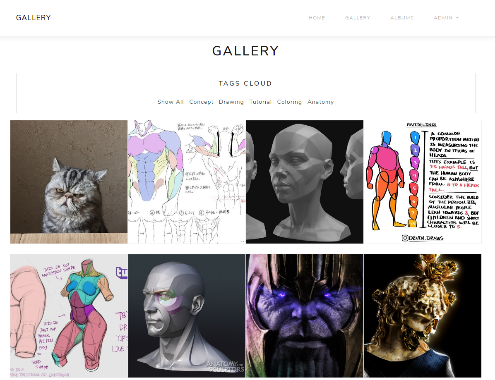
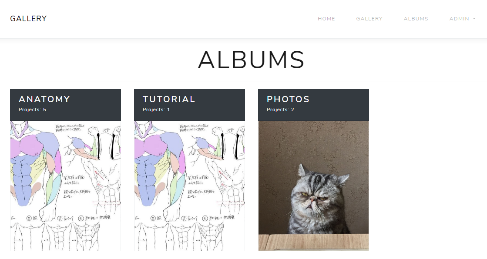
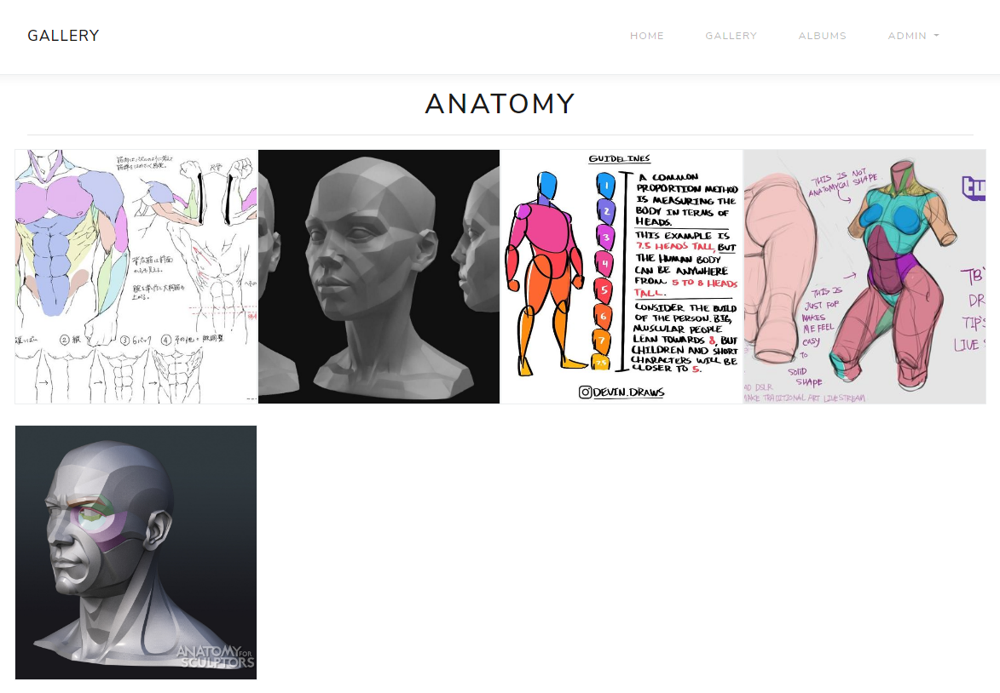
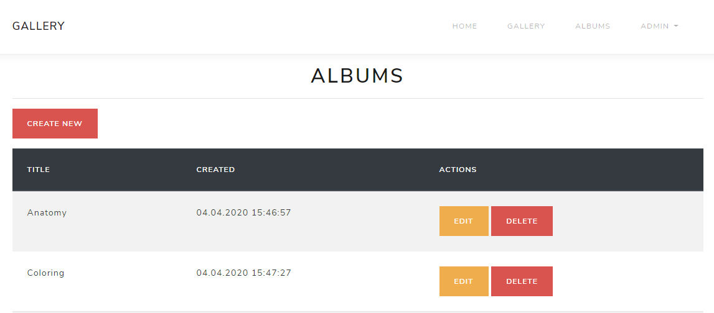
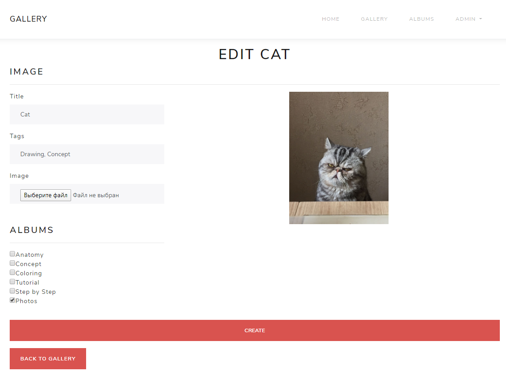

## Gallery - ASP.Net Core
Web-project based on ASP.Net Core 3.0.  
Used Bootstrap theme - [Bootswatch/LUX](https://bootswatch.com/lux/)

#### Requirements:
   - ASP.Net Core 3.0
   - Microsoft SQL Server
   - Entity Framework Core
   - Bootstrap 4

#### How to set up a database  
   - Download MS SQL Server backup files - [download](https://github.com/leodeg/CSharp.Gallery/releases/download/version-0.1-alpha/GalleryDB.bak)
   - Restore the database from backup file at SQL Server Management Studio

#### How to run the application
  - Set up the database 
  - Clone/Download the project - [download](https://github.com/leodeg/CSharp.Gallery/archive/master.zip)
  - Open the project from your IDE
  - Run application

## Screenshots
### Gallery

### Albums

### Create/Edit Image

